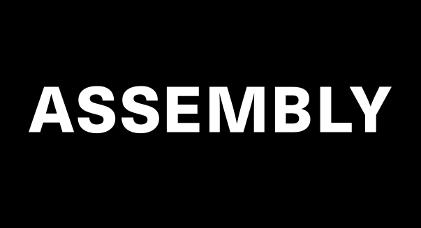
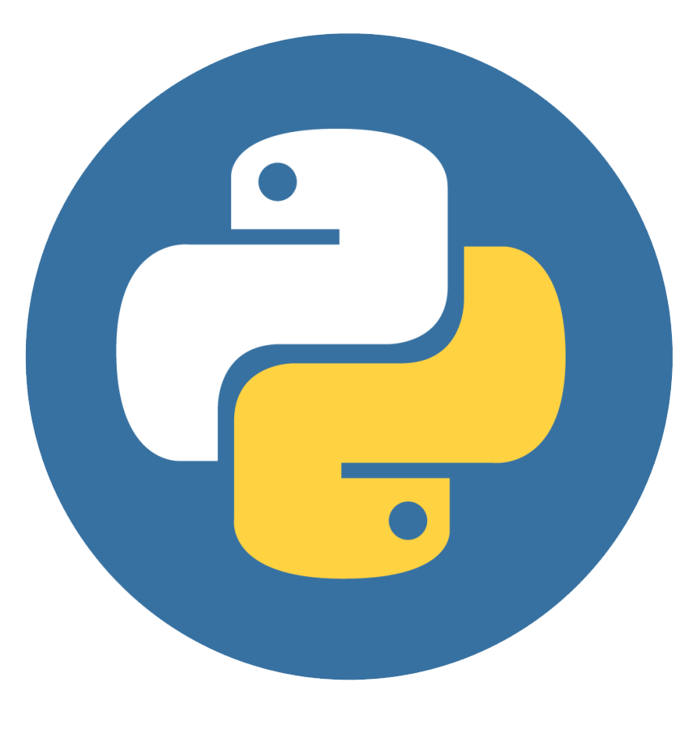

# Hi, I'm Alexandru !

## I'm a Computer Science Student, Freelancer and Teacher!

- 📚 I’m currently learning React, Angular, Racket and Haskell
- 🤝 I’m looking for colaboration and technology development oportunities!
- 🥅 2022 Goals: Become Candidate Master on Codforces and make my Startup known to the world!
- ⚡ Interests: I love playing chess, football, Football tennis | Passionate about Crypto and Investments
### Connect with me:

<!---

&nbsp;&nbsp;

&nbsp;&nbsp;
-->

&nbsp;&nbsp;

&nbsp;&nbsp;

&nbsp;&nbsp;

### Languages and Tools:

<!---

-->

<!---

-->

   
   
  :zap: GitHub Stats

  
   
   
  
  :zap: Coding Stats
   
  

